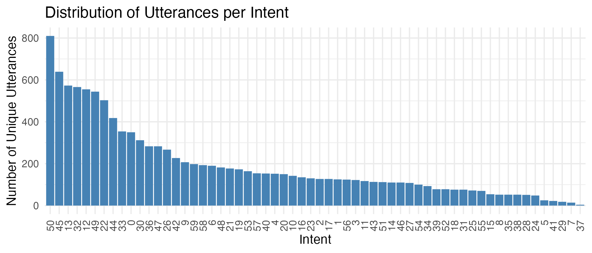
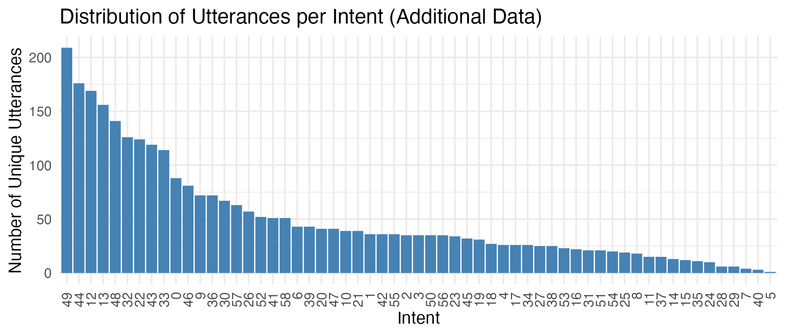

# Abstract

Voice-activated virtual assistants, like Amazon Alexa, have revolutionized human-computer interaction by responding in real-time to user instructions, known as "utterances." These utterances are mapped to specific "intents," which guide Alexa in executing the correct tasks. This paper explores how Alexa processes and maps utterances to intents, using different NLP techniques.

According to a 2018 paper titled "Efficient Large-Scale Neural Domain Classification with Personalized Attention," Alexa uses LSTM (Long Short-Term Memory) networks and personalized attention techniques to map utterances to intents ([Kim et al., 2018](https://pages.cs.wisc.edu/~ybkim/paper/acl2018.pdf)). While this paper provides valuable insights, it is uncertain if these methods are still in use today. 

AmazonScience, the team within Amazon Alexa responsible for intent prediction, has released the MASSIVE dataset on HuggingFace, providing valuable resources for NLP research ([link](https://huggingface.co/datasets/AmazonScience/massive)). By leveraging the MASSIVE dataset, this paper aims to explore how BERT performs on mapping utterances to intent.

# Introduction

In this paper, I will explore the use of various BERT (Bidirectional Encoder Representations from Transformers) models to map utterances to intents. This decision stems from my prior experience using BERT for different natural language processing tasks, and a desire to investigate its applicability for multiclass classification, specifically in the context of intent recognition for Alexa.

Having worked as an engineer at Alexa, I am familiar with the intricacies of this problem. My engineering background provided a deep understanding of the challenges in accurately mapping user utterances to the correct intents. However, I wanted to approach this problem from a Machine Learning perspective, leveraging the powerful capabilities of BERT models.

It is important to set realistic expectations for the outcomes of these experiments. The dataset from AmazonScience, known as the MASSIVE dataset, is quite large. Due to constraints in time and computational resources, I am conducting these experiments on Google Colab. Consequently, the results of this study may not match the performance levels achieved in the AmazonScience paper. Nevertheless, this exploration aims to provide insights into the use of BERT for intent recognition and contribute to the ongoing research in this area.

# Background

## BERT for Multiclass Classification

BERT (Bidirectional Encoder Representations from Transformers) has become a leading model in the field of natural language processing due to its ability to understand the context of words in a sentence by considering the entire sentence bidirectionally. BERT has been successfully applied to a wide range of tasks, including multiclass classification, where it has demonstrated significant improvements in performance compared to previous models [Devlin et al., 2019; Amazon Science, 2023].

For example, a study by Devlin et al. (2019) demonstrated that BERT achieves state-of-the-art results on a variety of sentence classification tasks, such as the Stanford Sentiment Treebank (SST-2) and the Multi-Genre Natural Language Inference (MNLI) benchmarks [Devlin et al., 2019]. This success is attributed to BERT's deep bidirectional representations, which enable it to capture complex dependencies between words and improve classification accuracy.

## Alexa's Intent Mapping

Amazon Alexa processes user utterances by mapping them to predefined intents, which represent the actions Alexa should take in response to the user's request. This process involves several steps:

1. **Automatic Speech Recognition (ASR)**: Converts the spoken utterance into text.
2. **Natural Language Understanding (NLU)**: Analyzes the text to determine the user's intent and extract relevant entities.
3. **Intent Mapping**: Matches the analyzed text to a predefined intent using machine learning models [Amazon Science, 2023].

According to the 2018 paper by Kim et al., Alexa initially used LSTM networks combined with personalized attention mechanisms to improve the accuracy of intent recognition. The LSTM networks help in capturing the temporal dependencies in the input sequences, while the personalized attention mechanism allows the model to focus on the most relevant parts of the input for each specific user [Kim et al., 2018]. However, given the rapid advancements in NLP, it is likely that Amazon has continued to innovate and improve upon these methods.

# Methodology

## Exploratory Data Analysis (EDA)

The first step in our analysis will be conducting exploratory data analysis (EDA) to gain a better understanding of the dataset. This involves the following steps:

1. **Dataset Length**: We will determine the length of the dataset, both for the training and test sets.
2. **Utterance Length**: We will calculate the average length of an utterance in characters and words.
3. **Distribution of Utterances per Intent**: We will examine the distribution of utterances across different intents in both the training and test sets to ensure a roughly equal distribution.

All EDA will be conducted using a Jupyter notebook.

## Models

We will approach this problem as a multiclass classification problem. Specifically, we will try three BERT models to evaluate their performance in mapping utterances to intents.

### Pretrained BERT Model

For our experiments, we will use a pretrained version of BERT from HuggingFace called `bert-base-cased`. This model is well-suited for a variety of NLP tasks, including multiclass classification.

### Tokenization

We will use the equivalent pretrained BERT tokenizer from HuggingFace, also called `bert-base-cased`. The tokenization process will involve the following steps:

1. **Tokenizing the Train and Test Sets**: Both the training and test sets will be tokenized using the `bert-base-cased` tokenizer.
2. **Transforming Labels to Categorical**: The labels in the train and test sets will be transformed into categorical values to facilitate the classification process.

## Models

### 1. BERT using the pooler output.
We will start with a BERT model using the pooler output for multiclass classification, this as the pooler output it's the standard for using BERT. 
The model is based on the BERT tokenization, using the inputs, attention mask layers and token type layer.
It follows by running the pretrained BERT model and using the pooler output, passing that through a Dense hidden layer, followed by a Dropout layer and a final multiclass classification layer using softmax.

The model architecture is as follows:

\begin{table}[ht]
\centering
\resizebox{\textwidth}{!}{
\begin{tabular}{|l|l|l|l|}
\hline
\textbf{Layer Type} & \textbf{Output Shape} & \textbf{Param \#} & \textbf{Connected to} \\ \hline
InputLayer (input\_ids\_layer) & (None, 200) & 0 & [] \\ \hline
InputLayer (attention\_mask\_layer) & (None, 200) & 0 & [] \\ \hline
InputLayer (token\_type\_ids\_layer) & (None, 200) & 0 & [] \\ \hline
TFBertModel (tf\_bert\_model\_2) & (None, 200, 768), (None, 768) & 108310272 & ['input\_ids\_layer[0][0]', 'attention\_mask\_layer[0][0]', 'token\_type\_ids\_layer[0][0]'] \\ \hline
Dense (dense\_10) & (None, 201) & 154569 & ['tf\_bert\_model\_2[0][1]'] \\ \hline
Dropout (dropout\_119) & (None, 201) & 0 & ['dense\_10[0][0]'] \\ \hline
Dense (dense\_11) & (None, 60) & 12120 & ['dropout\_119[0][0]'] \\ \hline
\end{tabular}
}
\caption{Model Architecture: BERT using the pooler output}
\end{table}

### 2. BERT using the average of the output.

The second model utilizes the average of the BERT output for multiclass classification. This involves taking the average of the last hidden state outputs instead of using the pooler output. 

The model is based on BERT tokenization, using input layers, attention mask layers, and token type layers. It then runs the pretrained BERT model, computes the average of the last hidden state outputs, and passes this through a Dense hidden layer, followed by a Dropout layer, and a final multiclass classification layer using softmax.

The model architecture is as follows:

\begin{table}[ht]
\centering
\resizebox{\textwidth}{!}{
\begin{tabular}{|l|l|l|l|}
\hline
\textbf{Layer Type} & \textbf{Output Shape} & \textbf{Param \#} & \textbf{Connected to} \\ \hline
InputLayer (input\_ids\_layer) & (None, 200) & 0 & [] \\ \hline
InputLayer (attention\_mask\_layer) & (None, 200) & 0 & [] \\ \hline
InputLayer (token\_type\_ids\_layer) & (None, 200) & 0 & [] \\ \hline
TFBertModel (tf\_bert\_model\_7) & (None, 200, 768), (None, 768) & 108310272 & ['input\_ids\_layer[0][0]', 'attention\_mask\_layer[0][0]', 'token\_type\_ids\_layer[0][0]'] \\ \hline
TFOpLambda (tf.math.reduce\_mean\_3) & (None, 768) & 0 & ['tf\_bert\_model\_7[0][0]'] \\ \hline
Dense (dense\_17) & (None, 201) & 154569 & ['tf.math.reduce\_mean\_3[0][0]'] \\ \hline
Dropout (dropout\_309) & (None, 201) & 0 & ['dense\_17[0][0]'] \\ \hline
Dense (dense\_18) & (None, 60) & 12120 & ['dropout\_309[0][0]'] \\ \hline
\end{tabular}
}
\caption{Model Architecture: BERT averaging the last layer output}
\end{table}

### 3. BERT + CNN
For the third model, we attach a CNN (Convoluted Neural Networks) to process the output from the last layer of the pretrained BERT model. The CNN consists of 5 layers, each with increasing kernel sizes. This output is then passed through dropout and softmax layers for classification.

The model architecture is as follows:

\begin{table}[ht]
\centering
\resizebox{\textwidth}{!}{
\begin{tabular}{|l|l|l|l|}
\hline
\textbf{Layer Type} & \textbf{Output Shape} & \textbf{Param \#} & \textbf{Connected to} \\ \hline
InputLayer (input\_ids\_layer) & (None, 200) & 0 & [] \\ \hline
InputLayer (attention\_mask\_layer) & (None, 200) & 0 & [] \\ \hline
InputLayer (token\_type\_ids\_layer) & (None, 200) & 0 & [] \\ \hline
TFBertModel (tf\_bert\_model\_6) & (None, 200, 768), (None, 768) & 108310272 & ['input\_ids\_layer[0][0]', 'attention\_mask\_layer[0][0]', 'token\_type\_ids\_layer[0][0]'] \\ \hline
Conv1D (conv1d\_10) & (None, 199, 131) & 201347 & ['tf\_bert\_model\_6[0][0]'] \\ \hline
Conv1D (conv1d\_11) & (None, 198, 127) & 292735 & ['tf\_bert\_model\_6[0][0]'] \\ \hline
Conv1D (conv1d\_12) & (None, 197, 51) & 156723 & ['tf\_bert\_model\_6[0][0]'] \\ \hline
Conv1D (conv1d\_13) & (None, 196, 23) & 88343 & ['tf\_bert\_model\_6[0][0]'] \\ \hline
Conv1D (conv1d\_14) & (None, 194, 17) & 91409 & ['tf\_bert\_model\_6[0][0]'] \\ \hline
GlobalMaxPooling1D (global\_max\_pooling1d\_10) & (None, 131) & 0 & ['conv1d\_10[0][0]'] \\ \hline
GlobalMaxPooling1D (global\_max\_pooling1d\_11) & (None, 127) & 0 & ['conv1d\_11[0][0]'] \\ \hline
GlobalMaxPooling1D (global\_max\_pooling1d\_12) & (None, 51) & 0 & ['conv1d\_12[0][0]'] \\ \hline
GlobalMaxPooling1D (global\_max\_pooling1d\_13) & (None, 23) & 0 & ['conv1d\_13[0][0]'] \\ \hline
GlobalMaxPooling1D (global\_max\_pooling1d\_14) & (None, 17) & 0 & ['conv1d\_14[0][0]'] \\ \hline
Concatenate (concatenate\_2) & (None, 349) & 0 & ['global\_max\_pooling1d\_10[0][0]', 'global\_max\_pooling1d\_11[0][0]', 'global\_max\_pooling1d\_12[0][0]', 'global\_max\_pooling1d\_13[0][0]', 'global\_max\_pooling1d\_14[0][0]'] \\ \hline
Dense (hidden\_layer) & (None, 201) & 70350 & ['concatenate\_2[0][0]'] \\ \hline
Dropout (dropout\_271) & (None, 201) & 0 & ['hidden\_layer[0][0]'] \\ \hline
Dense (dense\_16) & (None, 60) & 12120 & ['dropout\_271[0][0]'] \\ \hline
\end{tabular}
}
\caption{Model Architecture: BERT and CNN}
\end{table}

# Results and Discussion

## EDA Results

In this subsection, we present the results from the exploratory data analysis (EDA) conducted on the MASSIVE dataset. This includes insights into the dataset length, utterance length, and distribution of utterances per intent for both the training and test sets.

### Dataset Length

We examined the length of the dataset to understand its scale. The dataset is divided into training and test sets. Here are the details:

- **Training Set Length**: 11514
- **Test Set Length**: 2974

The test dataset represents 25.83% of the train dataset.

### Utterance Length

To gain insights into the structure of the utterances, we calculated the average length of an utterance in both characters and words. The average lengths are as follows:

- **Average Utterance Length in Characters**: 35.039
- **Average Utterance Length in Words**: 6.925

This is important as our pretrained BERT model can only handle a sequence of max 512 tokens. While the words are not strictly equal to a token it gives us a good estimate that the pretrained model will work. 
This also used as a guide to establish the variable "MAX_SEQUENCE_LENGTH" which is used in the model setup. I left it to be 200 as it covers all utterances.

### Distribution of Utterances per Intent

We analyzed the distribution of utterances across different intents to ensure a roughly equal distribution in both the training and test sets. The distribution is visualized in the following charts:

- **Training Set Distribution**:
```{r, echo=FALSE, message=FALSE, warning=FALSE}
library(ggplot2)

# Data for distribution of utterances per intent
data <- data.frame(
  intent = c(50, 45, 13, 32, 12, 49, 22, 44, 33, 0, 30, 36, 47, 26, 42, 9, 59, 58, 6, 48, 
             21, 19, 53, 57, 40, 4, 20, 10, 16, 23, 2, 17, 1, 56, 3, 11, 43, 51, 14, 46, 
             27, 54, 34, 52, 39, 31, 18, 25, 55, 15, 38, 8, 35, 28, 24, 5, 41, 29, 7, 37),
  unique_utt = c(810, 639, 573, 566, 555, 544, 503, 418, 354, 350, 312, 283, 283, 267, 227, 207, 
                 198, 193, 190, 182, 177, 173, 164, 154, 153, 152, 150, 142, 135, 130, 127, 127, 
                 125, 124, 122, 117, 113, 112, 110, 110, 108, 100, 93, 78, 78, 76, 76, 72, 70, 54, 
                 52, 52, 52, 51, 48, 25, 22, 18, 14, 4),
  percentage = c(7.034914, 5.549766, 4.976550, 4.915755, 4.820219, 4.724683, 4.368595, 3.630363, 
                 3.074518, 3.039778, 2.709745, 2.457877, 2.457877, 2.318916, 1.971513, 1.797811, 
                 1.719646, 1.676220, 1.650165, 1.580684, 1.537259, 1.502519, 1.424353, 1.337502, 
                 1.328817, 1.320132, 1.302762, 1.233281, 1.172486, 1.129060, 1.103005, 1.103005, 
                 1.085635, 1.076950, 1.059580, 1.016154, 0.981414, 0.972729, 0.955359, 0.955359, 
                 0.937989, 0.868508, 0.807712, 0.677436, 0.677436, 0.660066, 0.660066, 0.625326, 
                 0.607956, 0.468994, 0.451624, 0.451624, 0.451624, 0.442939, 0.416884, 0.217127, 
                 0.191072, 0.156331, 0.121591, 0.034740)
)

# Create the plot
plot <- ggplot(data, aes(x = reorder(as.factor(intent), -unique_utt), y = unique_utt)) +
  geom_bar(stat = "identity", fill = "steelblue") +
  labs(title = "Distribution of Utterances per Intent",
       x = "Intent",
       y = "Number of Unique Utterances") +
  theme_minimal() +
  theme(axis.text.x = element_text(angle = 90, vjust = 0.5, hjust=1))

# Print the plot
#print(plot)

# Save the plot with specific dimensions
ggsave("utterance_distribution.png", plot, width = 7, height = 3)
```


- **Test Set Distribution**:
```{r, echo=FALSE, message=FALSE, warning=FALSE}
library(ggplot2)

# New data for distribution of utterances per intent
data2 <- data.frame(
  intent = c(50, 45, 13, 32, 12, 49, 22, 44, 33, 0, 30, 47, 36, 26, 42, 9, 58, 6, 48, 21,
             19, 53, 57, 40, 4, 20, 10, 16, 23, 17, 2, 1, 56, 3, 11, 43, 51, 14, 46, 27,
             54, 34, 52, 39, 31, 18, 25, 55, 15, 38, 8, 35, 28, 24, 5, 41, 29, 7, 37),
  unique_utt = c(35, 32, 156, 126, 169, 209, 124, 176, 114, 88, 67, 41, 72, 57, 36, 72,
                 51, 43, 141, 39, 31, 23, 63, 3, 26, 41, 39, 22, 34, 26, 35, 36, 35, 35,
                 15, 119, 21, 13, 81, 25, 20, 26, 52, 43, 21, 27, 19, 36, 12, 25, 18, 11,
                 6, 10, 1, 51, 6, 4, 15),
  percentage = c(7.034914, 5.549766, 4.976550, 4.915755, 4.820219, 4.724683, 4.368595, 3.630363,
                 3.074518, 3.039778, 2.709745, 2.457877, 2.457877, 2.318916, 1.971513, 1.797811,
                 1.676220, 1.650165, 1.580684, 1.537259, 1.502519, 1.424353, 1.337502, 1.328817,
                 1.320132, 1.302762, 1.233281, 1.172486, 1.129060, 1.103005, 1.103005, 1.085635,
                 1.076950, 1.059580, 1.016154, 0.981414, 0.972729, 0.955359, 0.955359, 0.937989,
                 0.868508, 0.807712, 0.677436, 0.677436, 0.660066, 0.660066, 0.625326, 0.607956,
                 0.468994, 0.451624, 0.451624, 0.451624, 0.442939, 0.416884, 0.217127, 0.191072,
                 0.156331, 0.121591, 0.034740)
)

# Create the plot
plot2 <- ggplot(data2, aes(x = reorder(as.factor(intent), -unique_utt), y = unique_utt)) +
  geom_bar(stat = "identity", fill = "steelblue") +
  labs(title = "Distribution of Utterances per Intent (Additional Data)",
       x = "Intent",
       y = "Number of Unique Utterances") +
  theme_minimal() +
  theme(axis.text.x = element_text(angle = 90, vjust = 0.5, hjust=1))

# Print the plot
#print(plot2)

# Save the plot with specific dimensions
ggsave("test_utterance_distribution.png", plot2, width = 7, height =3)
```


With this EDA we conclude that we have enough data to train and validate our models. We also corroborate that the train and testing datasets are evenly distributed.

## Model Results

### Model setup
In the face of resource constraints (lack of computing power). Each model was run with the following parameters:
- Epochs = 1
- Batch Size = 10
- Learning rate = 0.00005

All the models were run using 4TPUs using Google Colab. See references for link to the code.

In this subsection, we present the results of the three different BERT models I tested for intent recognition. The table below summarizes the runtime, loss, accuracy, validation loss, and validation accuracy for each model.

```{r, echo=FALSE, message=FALSE, warning=FALSE}
library(knitr)
library(kableExtra)

# Data for model results
model_results <- data.frame(
  Model = c("BERT w pooler output", "BERT w/ averaged output", "BERT and CNN"),
  Runtime = c("25m", "24.76m", "47.35m"),
  Loss = c(1.6619, 1.0586, 1.2624),
  Accuracy = c(0.5906, 0.7440, 0.6950),
  `Validation Loss` = c(3.6678, 3.4003, 3.2038),
  `Validation Accuracy` = c(0.4469, 0.4839, 0.4785)
)

# Create the table
kable(model_results, caption = "Model Results") %>%
  kable_styling(latex_options = c("striped", "hold_position"))
```

The first thing to note about this results is that the validation accuracy is lacking. Since this point I defined success by increasing validation accuracy above 0.50.

I noticed a few things in order to prepare for a second round of models.
First the loss is still improvable, so for a second round I decided to push the learning rate to 0.0001.
I also decided to try more training epochs.

```{r, echo=FALSE, message=FALSE, warning=FALSE}
library(knitr)
library(kableExtra)

# Data for model results
model_results_2 <- data.frame(
  Model = c("BERT w pooler output", "BERT w/ averaged output", "BERT and CNN"),
  Epochs = c(2, 3, 2),
  Runtime = c("19.41m", "73.44m", "4.25h"),
  Loss = c(0.5706, 0.3624, 0.8156),
  Accuracy = c(0.8688, 0.9114, 0.8016),
  `Validation Loss` = c(3.4729, 4.7088, 0.7981),
  `Validation Accuracy` = c(0.4778, 0.4667, 0.7946)
)

# Create the table
kable(model_results_2, caption = "Model Results: 2nd Round") %>%
  kable_styling(latex_options = c("striped", "hold_position"))
```

From this results we can gather a few learnings:

- For the BERT w pooler output and BERT w/ average output the extra epoch seems to be overfitting the model, since the accuracy significantly increased but the validation accuracy barely did.

- The best model in this experiment proved to be BERT + CNN. The validation accuracy significantly improved with a second epoch and it's matching the training accuracy better.

# Conclusion

The best model from these experiments was the BERT + CNN model. Despite taking roughly 4 hours to complete, it achieved a validation accuracy above 0.50, making this experiment a success. This model's performance demonstrates the potential benefits of combining BERT with CNN for complex multiclass classification tasks.

Throughout this experiment, we learned that increasing the number of epochs does not necessarily lead to better results. It's crucial to evaluate models using test or validation data to get a reliable measure of their performance. This insight underscores the importance of using validation metrics to guide model tuning and selection.

If the classification task had been simpler, with fewer classes and a more even distribution among the classes, the BERT model with averaged output might have been a suitable option. In fact, BERT with averaged output is likely a good starting point for classification tasks using BERT, given its balance of performance and computational efficiency.

It's important to note that we don't have access to the actual model used by Alexa, and our experiment was conducted with more limited resources. Therefore, it would be unfair to compare our results directly with those of the actual Alexa model. Nonetheless, this study provides valuable insights into the use of BERT for intent recognition and lays the groundwork for future research in this area.

# References

1. Kim, Y.-B., Kim, D., Han, K., and Lee, Y. (2018). Efficient Large-Scale Neural Domain Classification with Personalized Attention. Retrieved from [https://pages.cs.wisc.edu/~ybkim/paper/acl2018.pdf](https://pages.cs.wisc.edu/~ybkim/paper/acl2018.pdf)

2. Devlin, J., Chang, M.-W., Lee, K., and Toutanova, K. (2019). BERT: Pre-training of Deep Bidirectional Transformers for Language Understanding. Retrieved from [https://arxiv.org/abs/1810.04805](https://arxiv.org/abs/1810.04805)

3. Amazon Science (2023). AmazonScience/massive Dataset. Retrieved from [https://huggingface.co/datasets/AmazonScience/massive](https://huggingface.co/datasets/AmazonScience/massive)

4. Github repo with calculations and models: https://github.com/Carla08/alexa_utt_intention_bert